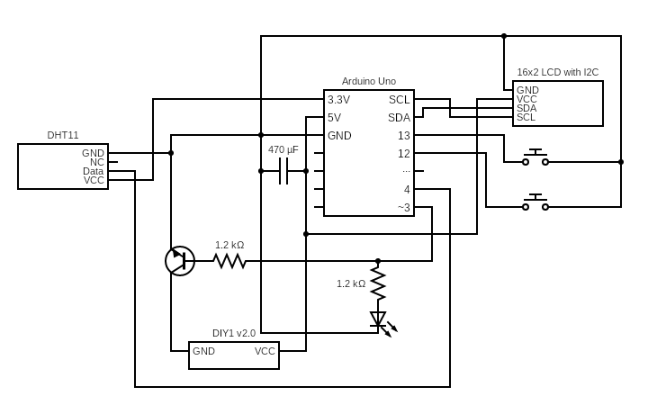

# Bulbulator – Smart Humidifier Controller 💧

This project is a simple DIY smart humidifier controller that keeps your room humidity at a desired level.  
It uses a DHT11 sensor to monitor humidity, a 16x2 LCD to display current and target values, and two buttons for setting the target humidity.  
The humidifier is switched on and off automatically via a relay or NPN transistor.

---

## ❔ How It Works

- Press **Button UP** to increase the target humidity value (displayed on LCD).  
- Press **Button SET** to confirm the target humidity.  
- The DHT11 sensor continuously reads the room humidity.  
- If the current humidity falls below the target, the humidifier is turned on.  
- Once the target humidity is reached, the humidifier turns off automatically.  
- The LCD shows the live humidity and the set target.  

---

## ⭐ Features

- Simple two-button interface to set humidity target  
- Real-time display of current and target humidity on 16x2 LCD  
- Automatic humidifier control NPN transistor  
- Easy to build and customize  
- Low power consumption — humidifier runs only when needed  

---

## 🧰 Components

- **Arduino Uno** – Microcontroller  
- **DHT11** – Humidity and temperature sensor  
- **16x2 LCD I²C** – Humidity display  
- **NPN Transistor** – Controls humidifier power  
- **Humidifier (DIY1 v2.0)** – Ultrasonic module  
- **2x Push Buttons** – For setting and confirming humidity  
- **LEDs (optional)** – Status indicators  
- **Power source** – USB or 5V–12V  
- **Capacitor 470μF** – Power supply stabilizer  
- **Resistors, wires** – Basic electronic components  

---

## 🔌 Wiring Diagram

  

---

## 🖥️ Usage

1. Connect all components according to the wiring diagram.  
2. Upload the Arduino sketch using Arduino IDE.  
3. Power the system.  
4. Use **Button UP** to set your desired humidity target.  
5. Press **Button SET** to confirm.  
6. The Bulbulator will monitor the humidity and control the humidifier accordingly.  
7. Check current and target humidity on the LCD.  

---

## ⚖ Pros and Cons

### ✅ Pros
- Simple and easy-to-build design.  
- Clear real-time feedback on LCD (current and target humidity).  
- Easy to customize (different sensors, displays, or control modules can be used).  

### ❌ Cons
- **Sensor placement:** The DHT11 was mounted too close to the humidifier outlet, causing it to saturate with steam and give unreliable readings.  
- **No hysteresis:** The control logic switches the humidifier on/off immediately at the threshold, leading to frequent toggling.  
- **Power supply instability:** With a long USB power cable, the LCD sometimes lost power or flickered when the humidifier module turned on due to voltage drops.
- **No water level monitoring:** There’s no way to check the humidifier’s water level, which can lead to running dry.  

---

## 📚 Libraries

- **Wire.h**  
  Handles I2C communication – required for the LCD display (and any other I2C devices).  

- **LiquidCrystal_I2C.h**  
  Library for controlling the 16x2 LCD via the I2C interface – makes it easy to print text and numbers.  

- **DHT.h** (or **Dht11.h**, depending on the version you use)  
  Used to read humidity and temperature values from the DHT11 sensor.  

---

### Made with 💙 by [Oliwier Gramala]  
